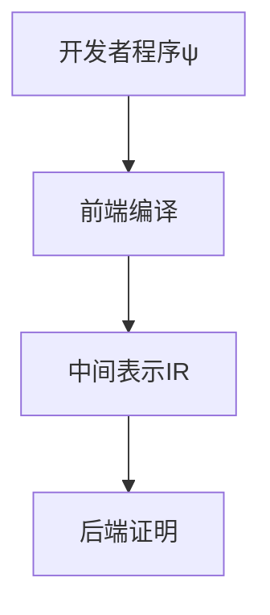

# SNARK性能评估与优化路径详解

## 1. SNARK基础概念

### 1.1 定义与核心特性
- **SNARK** (Succinct Non-interactive Arguments of Knowledge)
- 核心优势：
  - Succinct 简洁性：证明长度远小于原始数据; easy to verify;
  - Non-interactive 非交互式：单次通信完成验证
  - Arguments of Knowledge 知识证明：确保证明者确实持有有效数据

### 1.2 应用场景
- 区块链扩容（Layer2 Rollups）
- 隐私保护交易 (ZCash)
- 去中心化计算验证
  - 经典证明在以太坊上gas消耗案例：

  | 方案      | Gas消耗量 |
  | --------- | --------- |
  | PlonK     | 290,000   |
  | StarkWare | 5,000,000 |

## 2. SNARK技术架构

### 2.1 部署流程

### 2.2 核心组件

1. **前端处理**
   - 输入：验证程序ψ
   - 输出：SNARK友好型中间表示（算术电路/R1CS/AIR）
   - 关键技术：非确定性建议值(non-deterministic advice)
     - Typically, the ==IR== is some kind of *circuit-satisfiability instance* that is equivalent to ψ. This means that the circuit *C* takes as input the data *w*, as well as some extra inputs typically called ***non-deterministic advice***, and runs ψ on *w*. 
       - e.g., 证明程序中有x/y, 则商q和余数r被当作advice，circuit *C* 验证x = q*y + r, 而不是做除法验证
2. **后端证明系统**
   - 支持电路类型：算术电路/R1CS/AIR
   - 典型方案：Groth16/PlonK/Stark

## 3. 性能评估模型

### 3.1 开销分解

- **总开销** = 前端开销(F) × 后端开销(B)
- 典型值范围：relative to *direct witness checking*
  - F: 1000x or more
  - B: 1000x or more
  - 总开销：1,000,000x - 10,000,000x or more

### 3.2 应用可行性条件 (当今应用程序中使用 SNARK)

1. 原始验证时间 < 1秒
   - Direct witness checking takes much less than one second on a laptop.
2. 前端开销很小
   - Direct witness checking is particularly amenable to representation in a circuit
3. 接受长时证明生成（xx天为级别）或具备并行计算资源
   - You are willing to wait days for the SNARK prover to finish, and/or pay for huge parallel compute resources.

## 4. 前端实现方案

### 4.1 CPU emulator/虚拟机 (zkVM) 方案

|                     项目                      |                            指令集                            |                          电路转换率                          |       当前进展       |
| :-------------------------------------------: | :----------------------------------------------------------: | :----------------------------------------------------------: | :------------------: |
|           Cairo （CPU emulator）           | 定制指令Cairo: very limited assembly language: (1) addition&multiplication over finite field; (2) function calls;  (3)reads and writes to an immutable (i.e., write-once) memory | The Cairo frontend turns Cairo programs executing *T* primitive instructions into what is called a  **“degree-2 AIR with *T* rows and about 50 columns.” **50-100门/*T*指令 in Cairo CPU |        已部署        |
|         RISC Zero （CPU emulator）         | RISC-V开源架构： 简单指令集，比复杂指令集（x86, ARM）更容易处理 | As of May, RISC Zero is turning programs executing *T* primitive RISC-V instructions into  **degree-5 AIRs with 3*T* rows and 160 columns **~500门/*T*指令 in RISC-V CPU |      持续优化中      |
| zkEVM: zkSync 2.0, Scroll, Polygon's zkEVM | EVM: 无指令集，将高级语言如Solidity程序转换为电路之前编译为其他汇编语言 |              Performance results are pending...              | 开发中（多方案竞争） |

### 4.2 ASIC方案 (Application Specific Integrated Circuit) or FPGA加速器

- 优势：特定程序电路优化 
  - （对比CPU emulator方案：RISC-V and Cairo produce a single circuit that can handle all programs in the associated assembly language）
- 局限：
  - 不支持动态控制流
    - 不支持未预定迭代边界的循环： not known how to support loops without predetermined iteration bounds. 

### 4.3 使用快速的有限域

- **Goldilocks**域： $2^{64}-2^{32}+1$

  - 优势：
    - 这种特殊的结构的域 运算速度比其他域快几倍
  - 局限：
    - 仅自然支持32位数字的算术运算

- 主流方案域大小： $>2^{128}$

  

## 5. 后端瓶颈分析

### 5.1 多项式承诺方案对比

|     类型     |                           核心操作                           |              典型方案              |     复杂度     |
| :----------: | :----------------------------------------------------------: | :--------------------------------: | :------------: |
| 基于离散对数 |                多指数运算multi-exponentiation                | KZG/Bullteproofs/Dory/Hyrax-commit | O(n) group ops |
|   基于FFT    | large FFTs:  bottlenecked by **memory bandwidth** than by field operations. |         FRI、Ligero-commit         |   O(n log n)   |
|   基于哈希   | Merkle-hashing:  typically a bottleneck only if the circuit is small |           Merkle-hashing           |  O(n) hashes   |

- 基于离散对数：
  - involves a multi-exponentiation：
    -  In SNARKs, this degree is typically the size |*C*| of the circuit *C*.
    - a multi-exponentiation of size |*C*| requires about 1.5·|*C*|·log |*G*|≈ 400·|*C*| group operations, where |*G*| denotes the number of elements in the group *G*. 
  - Spartan: 
    - 使用 Hyrax 多项式承诺, 必须执行 $|C|^{1/2}$ 多个多重指数，每个指数的大小为 $|C|^{1/2}$，将 Pippenger 算法的加速比降低了大约 2 倍。
  - Groth16:
    - Prover must work over a pairing-friendly group
  - Marlin & PlonK:
    - 也需要配对，并且它们的证明者承诺远超过 3 个多项式。
  - Bulletproofs  (e.g., [Halo2](https://zcash.github.io/halo2/index.html), which is roughly PlonK but with Bulletproofs rather than KZG polynomial commitments)
    - the prover has to *compute logarithmically many multi-exponentiations* during the “opening” phase of the commitment scheme, and this largely erases any Pippenger speedup.

### 5.2 性能优化技术

1. **Pippenger算法优化**
   - 多指数运算加速比：~log(n)
   - 适用场景：|C| ≥ 2^25
2. **证明聚合(Proof Aggregation)**
   - 实现方式：$π_{agg}=SNARK\_agg\_prove(π_1,...,π_k)$
   - 优势：降低链上验证成本; 减少上链成本；

## 6.其他性能瓶颈

- memory：
  - 100 billion gates =>  tens or hundreds of terabytes of space for Prover.
- trusted setup

## 7. 未来优化方向

### 6.1 硬件加速

- GPU加速潜力：~10x
- ASIC加速潜力：~100x
- 内存带宽瓶颈：FFT类方案受限

### 6.2 协议层创新

1. 深度组合证明
   - 快速证明层 + 紧凑证明层
2. 新型多项式承诺方案
3. 域优化：
   - 特性$2^{64}-2^{32}+1$域应用
   - 硬件原生支持域运算

### 6.3 开发工具演进

- 形式化验证需求增长
- 高级语言编译器优化
- 自动电路生成工具

## 7. 实践建议

1. **应用场景选择**
   - 优先考虑：
     - 短时验证任务（<1秒）
     - 规则计算密集型任务
     - 可并行化计算任务
2. **技术选型策略**
   - 区块链场景：选择小证明方案（PlonK类）
   - 非链场景：考虑快速证明方案（Spartan类）
3. **资源规划**
   - 内存需求预估：100亿门 → ~100TB
   - 证明时间预估：1秒原始 → 10^6秒（~11天）

## 8. 研究前沿

- Brakedown方案：任意域支持
- Plonky2：递归证明组合
- Nova：增量可验证计算
- zkEVM：EVM完全兼容方案