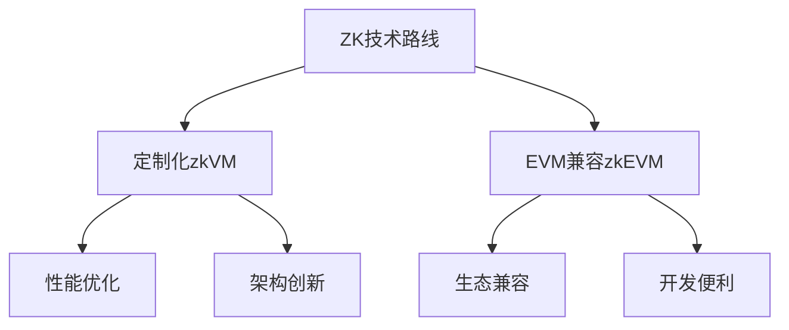

# 零知识证明技术全景：从SNARKs到STARKs的未来展望

## 引言：重新定义信任的密码学革命
零知识证明（Zero-Knowledge Proofs, ZKPs）作为密码学领域的「苏格拉底之问」，正在区块链世界掀起一场静默的革命。这项始于1980年代的理论突破，通过「证明真实性而不泄露信息」的独特属性，正在重构我们对隐私、可扩展性和链上验证的认知。

## 核心概念解析
### 零知识证明的本质
- **基本定义**：证明者（Prover）无需透露任何额外信息即可使验证者（Verifier）确信某命题的真实性
- **经典案例**：Alice通过排除26张黑牌证明持有红牌（♦️/♥️），无需展示具体牌面
- **数学表达**：对函数C(x,y)=true的验证，x为公开输入，y为秘密见证

### 关键技术突破
#### 1. zk-SNARKs（简洁非交互式知识论证）
- 安全基础：椭圆曲线密码学
- 核心特征：
  - 需要可信设置（Trusted Setup）
  - 固定参考字符串（不可更新）
  - 多项式承诺技术（KZG/Bulletproofs）
- 性能表现：
  - 验证时间：恒定级别
  - 证明时间：O(n log n)

#### 2. zk-STARKs（可扩展透明知识论证）
- 安全基础：哈希函数抗碰撞性
- 核心创新：
  - 透明性（无需可信设置）
  - FRI协议优化存储
- 性能突破：
  - 证明者复杂度：线性降低
  - 验证时间：O(polylog(n))


## 当前应用生态
### 基础设施层
| 项目          | 类型  | 技术特点                    | 代表应用           |
| ------------- | ----- | --------------------------- | ------------------ |
| StarkNet      | zkVM  | Cairo语言，冯诺依曼架构     | dYdX, Immutable    |
| zkSync        | zkEVM | EVM等效，zkPorter数据可用性 | Gitcoin, LayerSwap |
| Polygon Miden | zkVM  | 自定义指令集，状态模型优化  | 隐私DeFi协议       |

### 技术路线之争



## 未来应用展望

### 1. 零知识身份验证

- 实现路径：
  1. 链上凭证加密存储
  2. ZK电路生成信用证明
  3. 选择性披露验证机制
- 应用场景：
  - 匿名信用评分
  - 合规KYC验证
  - DAO治理准入

### 2. 隐私计算加速

- 突破性进展：
  - GPU加速证明生成（26倍速度提升）
  - ASIC/FPGA专用硬件开发
  - 分布式证明网络

### 3. 跨链互操作协议

```python
# 伪代码示例：ZK跨链验证
def zk_bridge_verify(source_chain, dest_chain, tx_proof):
    zk_circuit = compile_chain_state_transition()
    validity_proof = generate_zk_proof(zk_circuit, tx_proof)
    return verify_zk_proof(dest_chain.verifier_key, validity_proof)
```

## 技术挑战与演进方向

1. **证明生成效率**：
   - 递归证明组合技术
   - 硬件加速方案标准化
2. **开发者体验**：
   - 高级语言编译器优化（Noir/Circom）
   - 调试工具链完善
3. **密码学假设**：
   - 后量子安全算法研究
   - 新型承诺方案探索

## 结语：密码学新纪元的黎明

正如冯·诺依曼架构奠定了现代计算机的基础，零知识证明正在构建Web3时代的信任基础设施。从zkRollups的性能突破到隐私身份的革命性应用，这项技术正在以「证明即服务」的形式重构数字世界的信任边界。当ZK加速芯片开始嵌入手机处理器，当零知识验证成为链上交互的默认选项，我们或许会见证苏格拉底「自知无知」的智慧，在密码学领域绽放出最璀璨的应用之花。

------

